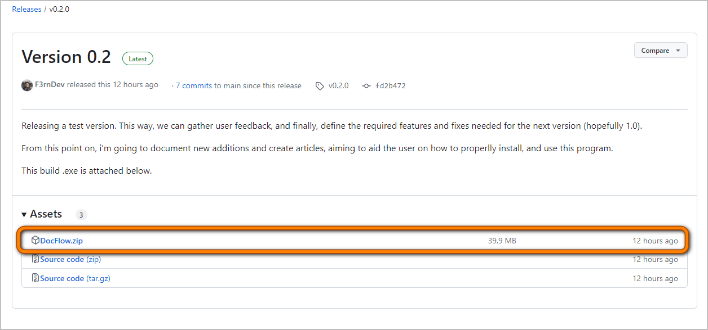
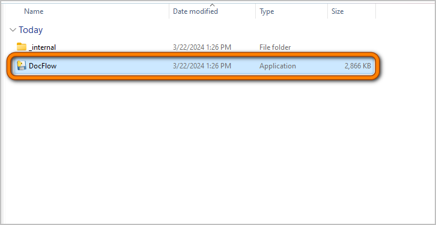
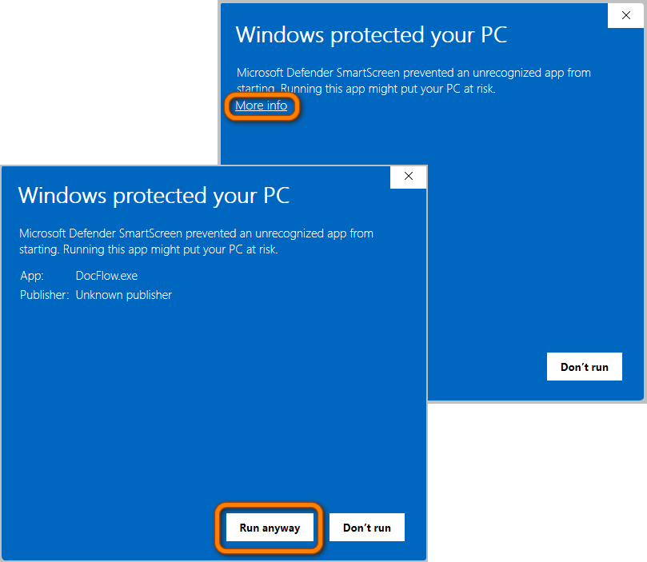

# Guia de instalação

## Baixando o Docflow
#### [Para instalar o Docflow em sua maquina, clique aqui](https://github.com/F3rnDev/DocFlow/releases/download/v0.2.0/DocFlow.zip).

Você também pode baixa-lo diretamente do repositório do projeto, caso o link acima não funcione. Para isso, siga os passos abaixo:

1. Acesse a página de [download](https://github.com/F3rnDev/DocFlow/releases/tag/v0.2.0)

2. Na seção "Assets", clique no arquivo `docflow.zip` para baixá-lo

## Executando o Docflow

1. Descompacte o arquivo em uma pasta de sua preferência

2. Execute o arquivo `docflow.exe`

3. Em certos casos, a tela abaixo pode ser exibida. Para prosseguir, clique em `Mais informações` e depois em `Executar assim mesmo`. Depois dessa primeira execução, o Windows não exibirá mais essa tela.

4. Pronto! A tela inicial do Docflow será exibida.